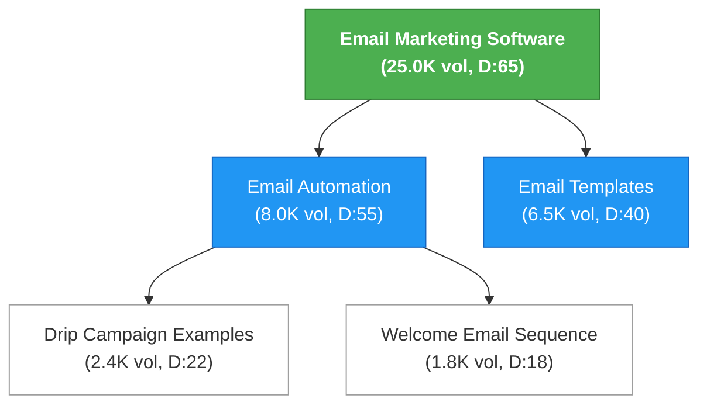

# Example Output Formats

Reference examples for the output files generated by this skill.

## strategy.md

```markdown
# SEO Content Strategy for example.com

Generated: 2024-01-15
Data source: DataForSEO Labs API

## Executive Summary

- **Site:** example.com (B2B SaaS — Email Marketing Platform)
- **Current state:** 45 indexed pages, ranking for ~230 keywords
- **Opportunity:** 180 new pages targeting 2,100+ keywords
- **Estimated traffic potential:** 25,000 monthly visits (+108% from current)
- **Gap keywords found:** 340 (competitors rank, you don't)
- **Featured snippet opportunities:** 67

## Key Insights

1. **Competitor gap is your biggest opportunity.** 340 keywords where competitors rank and you don't — these are validated by the market. Prioritize pages targeting these.
2. **Rising trends to capitalize on:** "AI email marketing", "email personalization at scale" — build content now before competition increases.
3. **Featured snippet wins available:** 67 keywords with snippet opportunities. Structure content as step-by-step guides or FAQ formats to capture these.

## Growth Phases

### Phase 1: Convert (Month 1-2) — 24 pages
Focus on bottom-of-funnel content that converts existing search traffic.

| Priority | Page | Keyword | Volume | Difficulty | Type |
|----------|------|---------|--------|------------|------|
| 1 | Email Marketing Software Comparison | email marketing software comparison | 8,100 | 45 | comparison |
| 2 | Mailchimp Alternatives | mailchimp alternatives | 6,600 | 38 | comparison |
| 3 | Email Automation Features | email automation software | 4,400 | 42 | service_page |
| ... | ... | ... | ... | ... | ... |

### Phase 2: Capture (Month 3-4) — 56 pages
Build out solution and use-case pages to capture consideration-stage traffic.

### Phase 3: Educate (Month 5-6) — 100 pages
Create educational content that builds topical authority and top-of-funnel awareness.

## Quick Wins (Low Difficulty, High Volume)

| Page | Keyword | Volume | Difficulty | Format |
|------|---------|--------|------------|--------|
| Drip Campaign Examples | drip campaign examples | 2,400 | 22 | listicle |
| Email Subject Line Tips | email subject line tips | 3,100 | 28 | guide |
| ... | ... | ... | ... | ... |

## Metrics Summary

| Metric | Value |
|--------|-------|
| Total pages planned | 180 |
| Total keywords targeted | 2,102 |
| Combined search volume | 892,000 |
| Average keyword difficulty | 42.3 |
| Gap keywords covered | 340 |
| Featured snippet targets | 67 |
| Competitors analyzed | 12 |
```

## page-plan.csv

```csv
page_id,primary_keyword,secondary_keywords,page_type,content_format,funnel_stage,combined_volume,avg_difficulty,priority_score,keyword_count,parent_page,has_featured_snippet,contains_gap_keywords,trend,description
p1,email marketing software,"email marketing tools; email marketing platform",pillar,service_page,decision,25000,65,18750,5,,true,true,stable,Main product page showcasing email marketing platform
c1,email automation,"automated email; email automation software",cluster,service_page,consideration,8000,55,5400,3,p1,false,true,rising,Feature page for automation capabilities
s1,drip campaign examples,,supporting,listicle,awareness,2400,22,2808,1,c1,true,false,stable,Examples and templates for drip campaigns
```

### Column Descriptions

| Column | Description |
|--------|-------------|
| page_id | Unique ID: p=pillar, c=cluster, s=supporting |
| primary_keyword | Main keyword this page targets |
| secondary_keywords | Semicolon-separated secondary targets |
| page_type | pillar / cluster / supporting / faq_hub / location_template |
| content_format | service_page / guide / how_to / comparison / listicle / faq_page / glossary / case_study |
| funnel_stage | awareness / consideration / decision |
| combined_volume | Total monthly search volume (primary + secondaries) |
| avg_difficulty | Average keyword difficulty (0-100) |
| priority_score | Calculated priority incorporating volume, difficulty, intent, gaps, trends |
| keyword_count | Number of keywords assigned to this page |
| parent_page | page_id of parent (empty for pillars) |
| has_featured_snippet | Whether any keyword has snippet opportunity |
| contains_gap_keywords | Whether page targets keywords competitors rank for |
| trend | rising / stable / declining |
| description | Brief description of page content and purpose |

## keyword-mapping.csv

```csv
keyword,page_id,role,search_volume,difficulty,intent,cpc,is_gap,serp_features
email marketing software,p1,primary,12000,65,commercial,12.50,true,"featured_snippet,sitelinks"
email marketing tools,p1,secondary,5000,60,commercial,10.20,true,sitelinks
email marketing platform,p1,secondary,3000,62,commercial,11.00,false,
email automation,c1,primary,4400,55,commercial,8.50,true,
drip campaign examples,s1,primary,2400,22,informational,2.10,false,featured_snippet
```

### Column Descriptions

| Column | Description |
|--------|-------------|
| keyword | The keyword string |
| page_id | Which page this keyword is assigned to |
| role | primary (one per page) or secondary |
| search_volume | Monthly search volume |
| difficulty | Keyword difficulty (0-100) |
| intent | informational / commercial / transactional / navigational |
| cpc | Cost per click in USD |
| is_gap | true if competitors rank and target doesn't |
| serp_features | Comma-separated SERP features present |

## diagram.md (Mermaid)

````markdown
# Topical Map - example.com

Generated: 2024-01-15
Data source: DataForSEO Labs API



## Legend

- **Green**: Pillar pages (broad themes, highest authority)
- **Blue**: Cluster pages (subtopics, link to pillar)
- **White**: Supporting pages (specific targets, link to cluster)
- **Orange**: FAQ hubs
- Numbers: combined search volume / difficulty score
````
